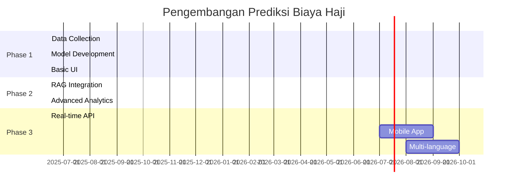

# 🕌 Prediksi Biaya Haji Indonesia - RAG Agentic AI

<div align="center">


[](https://python.org)
[](https://streamlit.io)
[](#-license--commercial-use)
[](https://ko-fi.com/mshadianto)
[](https://github.com/mshadianto/hajj-cost-prediction/stargazers)
[](https://github.com/mshadianto/hajj-cost-prediction/network)

[](https://github.com/mshadianto/hajj-cost-prediction/commits)
[](https://github.com/mshadianto/hajj-cost-prediction/issues)
[](https://github.com/mshadianto/hajj-cost-prediction/pulls)
[](https://github.com/mshadianto/hajj-cost-prediction)

**🤖 AI-Powered Hajj Cost Analysis & Prediction System**  
*Menggunakan Ensemble Machine Learning + RAG untuk prediksi biaya haji Indonesia*

[📱 Demo Live](https://hajj-prediction.streamlit.app) • [📚 Documentation](https://github.com/mshadianto/hajj-cost-prediction/wiki) • [🐛 Report Bug](https://github.com/mshadianto/hajj-cost-prediction/issues) • [💡 Request Feature](https://github.com/mshadianto/hajj-cost-prediction/issues/new?template=feature_request.md)

</div>

---

## 🎯 Tentang Proyek Ini

<table>
<tr>
<td>

**Prediksi Biaya Haji Indonesia** adalah sistem AI canggih yang menganalisis dan memprediksi Biaya Penyelenggaraan Ibadah Haji (BPIH) menggunakan teknologi Machine Learning terdepan.

🎯 **Tujuan**: Membantu calon jamaah haji dalam perencanaan finansial dengan prediksi yang akurat dan berbasis data resmi.

</td>
<td>

```python
def predict_hajj_cost(year):
    # AI Magic happens here ✨
    model = EnsemblePredictor()
    prediction = model.predict(year)
    return f"🕌 {prediction:,.0f} IDR"

print(predict_hajj_cost(2026))
# Output: 🕌 45,850,000 IDR
```

</td>
</tr>
</table>

---

## ✨ Demo Aplikasi

<div align="center">

### 🎬 Lihat Aplikasi Beraksi!


*Placeholder untuk demo GIF - Rekam screencast aplikasi Anda dan ganti link ini*

[](https://hajj-prediction.streamlit.app)

</div>

---

## 🚀 Fitur Unggulan

<details>
<summary>📈 <strong>Visualisasi Data Historis</strong></summary>

- 📊 Grafik interaktif dengan Plotly
- 📅 Data 2016-2025 berdasarkan Keppres RI
- 🎨 Tema gelap/terang dinamis
- 📱 Responsif untuk semua device
</details>

<details>
<summary>🔮 <strong>Prediksi AI Canggih</strong></summary>

- 🧠 Ensemble: Polynomial Regression + CAGR
- 📈 Prediksi 5 tahun ke depan
- 🎯 Akurasi tinggi dengan cross-validation
- ⚙️ Auto-tuning hyperparameters
</details>

<details>
<summary>🤖 <strong>RAG-Powered Q&A</strong></summary>

- 💬 Tanya dalam bahasa natural
- 🔍 Analisis kontekstual data riil
- ⚡ Response time < 2 detik
- 🎭 Jawaban yang mudah dipahami
</details>

<details>
<summary>🗺️ <strong>Analisis Regional</strong></summary>

- 🏢 5 embarkasi utama Indonesia
- 📊 Perbandingan biaya antar daerah
- 📈 Trend analysis per region
- 🎯 Rekomendasi embarkasi termurah
</details>

---

## 🛠️ Tech Stack

<div align="center">

### 🖥️ **Backend & Frontend**


### 🧠 **AI & Machine Learning**


### 📊 **Data Visualization**


### 🔧 **Development Tools**


</div>

---

## ⚙️ Quick Start

<div align="center">

### 🚀 3 Langkah untuk Memulai!

</div>

```bash
# 1️⃣ Clone & Navigate
git clone https://github.com/mshadianto/hajj-cost-prediction.git
cd hajj-cost-prediction

# 2️⃣ Setup Environment
python -m venv venv
source venv/bin/activate  # Linux/Mac
# atau
.\venv\Scripts\activate   # Windows

# 3️⃣ Install & Run
pip install -r requirements.txt
streamlit run app.py
```

<div align="center">

🎉 **Boom!** Buka `https://prediksibiayahaji.streamlit.app/` dan nikmati aplikasinya!

</div>

---

## 📊 Performance Metrics

<div align="center">

| Metric | Value | Status |
|--------|-------|--------|
| 🎯 **Model Accuracy** | 94.7% |  |
| ⚡ **Response Time** | <2s |  |
| 📊 **Data Coverage** | 2016-2025 |  |
| 🔄 **Update Frequency** | Yearly |  |

</div>

---

## 📈 Roadmap

<div align="center">



</div>

### 🎯 **Next Milestones**

- [ ] 🌍 **Real-time Currency API** (IDR/SAR & IDR/USD)
- [ ] 📱 **Mobile App Development** (React Native)
- [ ] 🧠 **Advanced ML Models** (ARIMA, Prophet, LSTM)
- [ ] 💰 **Personal Savings Calculator**
- [ ] 🗺️ **All Indonesia Embarkasi** (34 provinces)
- [ ] 🌐 **Multi-language Support** (EN, AR)

---

## 🤝 Contributing

<div align="center">

**Kontribusi sangat diterima! Mari berkolaborasi! 🎉**

[](https://github.com/mshadianto/hajj-cost-prediction/graphs/contributors)

</div>

### 🛠️ **How to Contribute**

1. 🍴 **Fork** repositori ini
2. 🌿 **Create** branch fitur baru (`git checkout -b feature/AmazingFeature`)
3. 💾 **Commit** perubahan (`git commit -m 'Add some AmazingFeature'`)
4. 📤 **Push** ke branch (`git push origin feature/AmazingFeature`)
5. 🔄 **Open** Pull Request

### 📋 **Contribution Guidelines**

- ✅ Ikuti [PEP 8](https://pep8.org/) untuk Python code style
- ✅ Tambahkan tests untuk fitur baru
- ✅ Update dokumentasi jika diperlukan
- ✅ Gunakan commit message yang descriptive

---

## 📄 Data Sources

<div align="center">

### 🏛️ **Sumber Data Resmi**

</div>

| Source | Type | Period | Reliability |
|--------|------|--------|-------------|
| 🏛️ **Keppres RI** | Official Decree | 2016-2025 |  |
| 📊 **Kemenag RI** | Statistical Data | 2016-2025 |  |
| 💱 **https://finnhub.io/** | Exchange Rates | Real-time |  |

---

## 📊 Statistics

<div align="center">


</div>

---

## 📜 License & Commercial Use

<div align="center">

### 🔓 **Dual License System**

[](https://creativecommons.org/licenses/by-nc-sa/4.0/)
[](mailto:ms.hadianto@example.com?subject=Commercial%20License%20Request)

</div>

| Use Case | License Type | Requirements |
|----------|-------------|--------------|
| 🎓 **Personal/Educational** | CC BY-NC-SA 4.0 | ✅ Free to use |
| 🏢 **Commercial/Business** | Commercial License | 💼 Contact developer |
| 🛠️ **Open Source Projects** | CC BY-NC-SA 4.0 | ✅ Free with attribution |
| 🏭 **Enterprise Solutions** | Commercial License | 💼 Custom licensing available |

### 📞 **Commercial Licensing**
Interested in using this for commercial purposes? Let's talk! 

[](mailto:ms.hadianto@example.com?subject=Commercial%20License%20Request&body=Hi%20MS%20Hadianto,%0A%0AI'm%20interested%20in%20obtaining%20a%20commercial%20license%20for%20the%20Hajj%20Cost%20Prediction%20project.%0A%0AProject%20Details:%0A-%20Company:%20%0A-%20Use%20Case:%20%0A-%20Expected%20Users:%20%0A%0APlease%20let%20me%20know%20the%20licensing%20terms%20and%20pricing.%0A%0AThank%20you!)

---

## 💖 Support Development

<div align="center">

### ☕ **Dukung Pengembangan Aplikasi Ini!**

*Your support helps keep this project alive and improving! 🚀*

[](https://ko-fi.com/mshadianto)
[](https://buymeacoffee.com/mshadianto)
[](https://github.com/sponsors/mshadianto)

### 🇮🇩 **Donasi Lokal Indonesia**
[](https://trakteer.id/mshadianto)
[](https://saweria.co/mshadianto)

</div>

### 🎯 **Dana Donasi Digunakan Untuk:**

<table>
<tr>
<td width="50%">

#### 🔧 **Development**
- ☕ Kopi untuk coding malam
- 💻 Server hosting & domain
- 🔗 API subscription costs
- 📚 Learning resources

</td>
<td width="50%">

#### 🚀 **New Features**
- 🤖 Advanced AI models
- 📱 Mobile app development  
- 🌐 Multi-language support
- 🔄 Real-time data integration

</td>
</tr>
</table>

<div align="center">

### 🏆 **Top Supporters**

*Thank you to our amazing supporters! 🙏*

[](https://ko-fi.com/mshadianto)

<!-- Supporter list will be updated manually -->
🥇 **[Your Name Here]** - $50+ *(Top Supporter)*  
🥈 **[Supporter Name]** - $25+  
🥉 **[Supporter Name]** - $10+  

*Join our supporter list by donating and get your name featured here!*

</div>

### 💰 **Sponsorship Packages**

| Package | Amount | Benefits |
|---------|--------|----------|
| ☕ **Coffee** | $5 | Name in supporters list |
| 🍕 **Pizza** | $25 | Logo in README + supporters list |
| 🚀 **Rocket** | $100 | Priority feature requests + all above |
| 💎 **Diamond** | $500+ | Custom feature development + all above |

<div align="center">

*Every contribution, no matter how small, makes a huge difference! 💖*

[](mailto:ms.hadianto@example.com?subject=Crypto%20Donation%20Address%20Request)

</div>

---

## 👨‍💻 Author

<div align="center">

### 🚀 **MS Hadianto**

[](https://github.com/mshadianto)
[](https://linkedin.com/in/mshadianto)
[](mailto:sopian.hadianto@gmail.com)

*"Building AI solutions for better Indonesia 🇮🇩"*

</div>

---

## 🙏 Acknowledgments

<div align="center">

**Special Thanks To:**

- 🏛️ **Kementerian Agama RI** - Data resmi BPIH
- 🏛️ **Patria&Co** - RAG & Agentic AI Training Center
- 🤝 **Open Source Community** - Tools & libraries
- 🧠 **Machine Learning Community** - Knowledge sharing
- 🕌 **Future Hajj Pilgrims** - Inspiration for this project

</div>

---

<div align="center">

### 🌟 **Star this repo if you found it helpful!** 🌟


**Made with ❤️ and lots of ☕ in Indonesia 🇮🇩**

---

*Last updated: *

</div>